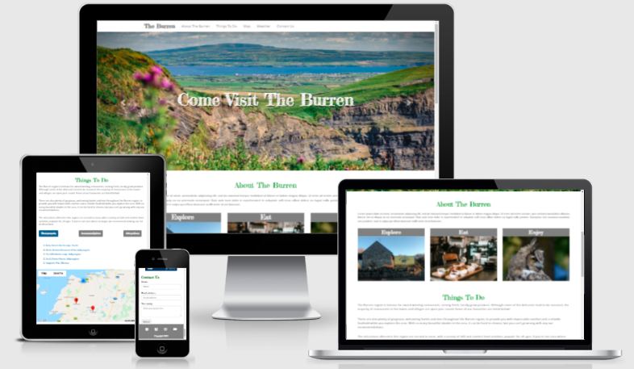
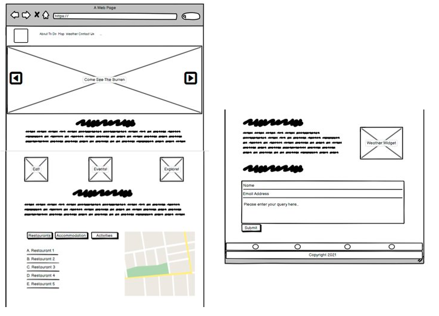
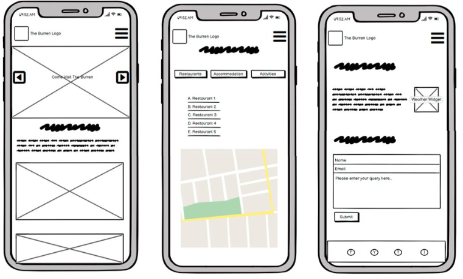
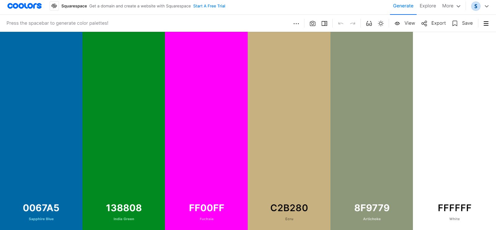
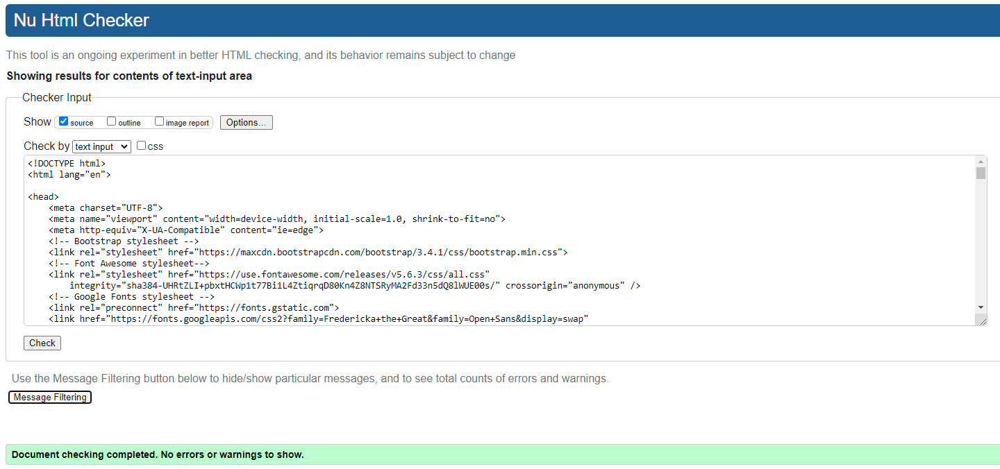
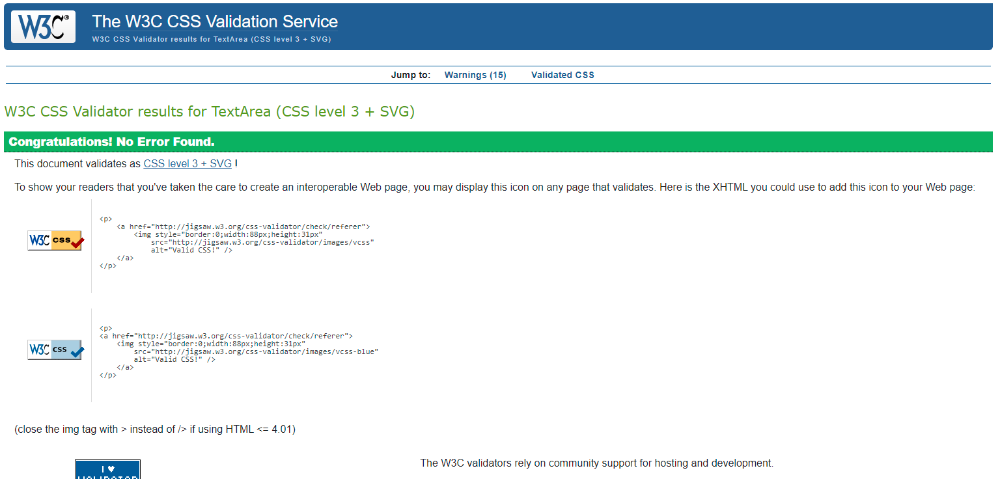

# **Milestone Project 2**

# Table of Contents

## Come Visit The Burren website

### Purpose

The purpose of this website is to provide relevant information for tourists visiting The Burren, Co. Clare, 
possibly as part of The Wild Atlantic Way. The website provides accessible information in the form of text, 
images and external links to restaurants, accommodation and tourist attractions. The places listed are displayed 
on the map (Google Maps API) available on the page. Site visitors can also submit a query via a user form. 

The site is laid out as a single, scrollable page, and is responsive on a variety of devices, both landscape and 
portrait. Each section is accessible via the navigation menu list. 

### **Details**

#### **'Homepage' section**
The 'Home' page header contains a simple navigation menu with brand text and section links. This menu is displayed 
as a drop-down toggle menu with hamburger button in mobile view. 

The navigation menu contains Home, About and Contact links (3-page website). 

The majority of the home page section contains a carousel slideshow, with 4 rotating images and a text overlay 
inviting users to ‘Come Visit The Burren’.  

#### **'About The Burren' section**
The first navigation menu link brings the site visitor to an ‘About The Burren’ section, which contains 
historical and factual details about the region. This section appears directly beneath the carousel slideshow, 
and can also be reached by scrolling down from the top of the home page section.  

#### **'Things To Do' section**
The ‘Things To Do’ section contains 3 inline images with headings. These are animated with a JavaScript fadeBox 
function on initial page load. Animation is visibile when scrolling down for the first time visiting the page 
(reload required to view the animation again). 

Text relating to ‘things to do’ in The Burren accompanies the images. 

#### **'Map' section**
The ‘Maps’ section is comprised of 2 parts – buttons and links, and the map itself. The 3 buttons update from 
displaying text to font awesome icons when in mobile view.  
JavaScript has been used to ensure that interchangeable lists are linked to the buttons and also the map display.

#### **'Climate and Weather' section**
The Climate and Weather section contains text regarding local climate, plus a weather widget, which adds to the 
information-providing feel of the site.

#### **'Contact Us' section**
The contact form uses the EmailJS to send the site visitor’s details and message to a designated, checkable email 
address. A separate javascript script file, sendEmail.js, contains the function required to achieve this (a function 
is also present in the <head> section of the HTML file). 

Once the form is submitted a pop-up box containing a 'success' message is displayed, and the form fields are cleared.

### **Responsivity**
The Burren website is responsive across a number of browsers, devices and orientations. The site is contained on one 
vertical, scrollable page. The navigation links bring the user down the page to the relevant sections. Many of the elements 
are side-by-side in desktop view, but placed on top of each other in mobile view. This provides an intuitive experience for 
the user. The 'Map' section, for example, displays the buttons, list and map, easily visible together vertically on a mobile 
screen. 
The mock-ups below display various sections of the overall website. 

### **UX (User Experience)** 

#### **Strategy Plane**
This website could be used as part of a tourism drive for the area, possibly a government funded initiative to bring more 
tourists to the area, and boost the economy. The website could also improve the area’s presence online.  
User needs are met, as inspiring imagery encourages further exploration of the site, which leads to relevant information 
on the region. The site owner’s objectives are also met, as the content and ease of use provide relevant information to site 
visitors. 

#### **Strategy Plane**
The website contains a variety of features that enhance the tourism aspect of the site. The carousel slideshow provides 
auto-changing imagery. Three images above the ‘Things To Do’ section fade in as the user’s scroll down, encouraging them to 
take more notice of the imagery and leading down to the descriptive text beneath. 
Three buttons are present that when pressed display lists (links) and related markers on the accompanying map for each topic 
(i.e. Restaurants, Accommodation, Attractions). 
A weather widget is present, which displays the time, temperature and windspeed for Co. Clare. 
A contact form (utilising EmailJS) is also present. Users can enter their name, email address and query. The form then resets 
once ‘Submit’ is pressed. A success pop-up message is displayed. Messages are successfully sent to the related mailbox.

#### **Structure Plane**
Structurally, the website is light and uniform. It is easily navigated by either scrolling or by clicking on the navigation links. 
Navigation buttons and toggle work as expected, links also bring the user to the expected point on the page.  
The carousel is the only full-width feature on the desktop website, with the remaining content structured within a white 
background. On mobile, items appear vertically stacked. 

#### **Skeleton Plane**
Balsamiq wireframes were used to plan the layout of the website on both on desktop and mobile. The same features appear in both 
views, however the buttons x 3 linked to the URL lists change from text to font awesome icons on mobile. The overall layout 
works well as a single scrolling page, as some sections are not very content heavy and would not look as relevant as single html 
pages. 

#### **Surface Plane**
The colour palette was drawn mostly from the images used in the carousel, grey, beige, green and white. The pops of pink provided 
by the flowers are the only use of bright colour on the site. This evokes the bright, stark feel of the Burren, but also the 
serenity and pleasantness of the area. The layout of the website is minimal but informative. The menu and footer icons are 
minimalistic to reduce intrusiveness. The images and map are the main focus of the site.  

### **User Stories**

#### **First Time User**

- The site's purpose is clear, I am the intended user (tourist, visitor to the area, planning a visit to the area)
- I can navigate the single page website easily. Scrolling up and down the page is intuitive and error free
- The navigation links lead to the expected sections on the website
- I can find out the information I was expecting in the appropriate sectio (sometimes accompanied with images/widget)
- The map displays the list of restaurants, accommodation and attractions as expected when each button is clicked.
- The external links for each restaurant ect. listed are valid and take me to the external site
- The contact form allows me to send a query to the site owner, for example request for information on the area/tourist information.
- The social media icons link to relevant platforms
- The website is accessible and works on a variety of devices, including my laptop and my phone
- The website is also available via different browsers (Chrome, Safari, MS Edge)

#### **Returning User**

- I can check if new links have been added to the list of restaurants, accommodation or attractions
- I can check the map to help navigate the area
- I can read the information about the area, refresh my memory on things to do and check the weather widget
- I can send a query/message to the site owner via the contact form
- I can check the social media sites via the footer icons

#### **Frequent User**

- I can use the map to find the places listed
- I can contact the site owner with any questions on the area
- I can check for new sections/information on the area

### **Testing**

This is a partially static website with three main JavaScript features: fade in images, buttons and text/urls linked 
to the Google Maps map, and the EmailJS contact form.
Testing will cover JavaScript feature workability, visual inspection (layout, image clarity, alignment), text 
inspection, link and button inspection, browser/device compatability, responsivity, 

| Action                              | Expected Result  | Result           | Status|
| :----------------------------------- | :---------------- | :---------------- | :----- |
| Hover on logo/brand| Mild shadow present| Mild shadow present| Pass  |
| Click on the logo/brand| No action performed| No action performed| Pass  |
| Hover on each menu item| Bold on hover| Bold on hover| Pass  |
| Hover on each menu item via toggle button/mobile view| Bold on hover| Bold on hover| Pass  |
| Click on the navigation items        | Expected sections displayed| Expected sections displayed| Pass  |
| Click on the navigation items via toggle button/mobile view        | Expected sections displayed| Expected sections displayed| Pass  |
| Click on the toggle button and navigation buttons in mobile view       | Navigation items are displayed and expected pages open  | Navigation items are displayed and expected pages open  | Pass  |
| View the carousel slider images| Four images, auto-change at equal intervals | Four images, auto-change at equal intervals  | Pass  |
| Click on the carousel chevrons/arrows x 2 | Moves to next/previous image | Moves to next/previous image | Pass  |
| Scroll down from top of page | Text and 3 images with fade in JS animation displayed  | Text and 3 images with fade in JS animation displayed  | Pass  |
| Scroll up and down again | Image animation only displayed initially or on page reload | Image animation only displayed initially or on page reload | Pass  |
| Scroll down to the map section | Three buttons, list of links and map are present| Three buttons, list of links and map are present  | Pass  |
| View the buttons and list | The first button is active and displays the 'Restaurants' list| The first button is active and displays the 'Restaurants' list | Pass  |
| Click on each button| The three buttons work as expected, display the correct lists and map markers | The three buttons work as expected, display the correct lists and map markers| Pass  |
| Click on the listed links | External sites open in new tab | External sites open in new tab | Pass  |
| Zoom in on map to view | Markers and clusters can be zoomed in on and read |  Markers and clusters can be zoomed in on and read present  | Pass  |
| Check each map button/feature| Each map button works as expected |  Each map button works as expected present  | Pass  |
| Accept weather widget cookies and check info| Weather widget information is up to date |  Weather widget information is up to date | Pass  |
| Enter name, email and text in the ‘Contact Us' form| Fields are populated correctly (e.g. email field requires an email) | Fields are populated correctly (e.g. email field requires an email) | Pass  |
| Click the Submit button when fields are empty | Warning pop-up appears if one or more fields unpopulated | Warning pop-up appears if one or more fields unpopulated | Pass  |
| Click the 'Submit' button | The form is cleared, a success pop-up is displayed, message received to designated mailbox | The form is cleared, a success pop-up is displayed, message received to designated mailbox | Pass  |
| Click on each social media icon in the footer in turn | Each platform is displayed in a new tab| Each platform is displayed in a new tab| Pass  |
| Resize the screen | Each element of the page is displayed as expected | Each element of the page is displayed as expected| Pass  |
| Check each image for skew/pixelation | Each image is clear and unskewed | Each image is clear and unskewed | Pass  |

#### **JavaScript Testing**
console.log was used to check for errors in the inspect element of the web browser.

#### **EmailJS Testing**
Please see screenshot of email sent from the website .

#### **Bug Fixes**
The form was not clearing when the 'Submit' button was clicked. A resetForm() method was added to the sendMail function to fix this.

### **Design**

#### **Wireframes**

The site layout (desktop/mobile) was planned using Balsamiq (www.balsamiq.com). See below. Full size images are available [here] 

_Full Desktop View_ 

_Mobile Views_ 

#### **Color Palette**

Coolers website (www.coolors.com) was used to compile the colour palette, which reflects the sky, earth, stone, sparse grass and 
petals shown in the images. Greys and beiges are popular colours in todays media, fashion and interiors, giving the site an up-to-date feel.

The main colours used from the palette are 'India Green' #138808, and 'Ecru' #C2B280. The other colours are reflected in the images and 
backgrounds.

#### **Images** 
The images on the site were provided by Pexels (www.pexels.com), Unsplash (www.unsplash.com) and me (2 images). Further details are provided 
in the Credits & Acknowledgements section below. 
The images are clear and unskewed, and do not clash with each other visually. They follow the theme of the site and suit the colour palette.

#### **Typography** 
The fonts used on the website were sourced from [Google Fonts](www.fonts.google.com). The font-families are 'Fredericka the Great' (cursive) 
and 'Open Sans' (sans-serif). 
The site brand, carousel caption, image headings, section headings and buttons used the 'Fredericka the Great' font, which does not feel over-used 
despite the number of placements. 'Open Sans' font was used for the navigation links, text list and general text. 

#### **Current Features** 
- The navigation menu is presented as a discreet row at the top of the page, switching to a minimalistic toggle button and list on mobile view.
- The carousel slides provide an informative visual on what to expect from the area the website is about, and the user can choose the speed of 
the slides by clicking on the next/previous arrows.
- The fade in JavaScript effect on the three images above the 'Things to Do' text provide a welcome animation to the site and draw the user's eye 
down to read the text.
- The main information section of the site is the map and accompanying buttons/list/links, which are easy to use and view, and informative.
- The weather widget is a regularly updating feature that users may find helpful when visiting the area
- The working form allows the user to email the site owner and to receive feedback that their message was sent 
- The footer contains social media icons that link to a new tab for the relevant platform

#### **Future Features**
- Seasonal information/brochure style detail could be added in future
- Scroll back to top button could be added to bring the user back to the navigation menu
- Social media accounts that relate to the site could be added

#### **Browser Compatability**
The site was tested with Chrome, Safari and Microsoft Edge. Compatible with each browser.

#### **Device Compatability**
The site was tested on a variety of virtual phones and tablets (via the browser inspect element), and also on a real-world Lenovo ThinkPad laptop, 
an iPhone X and a Huawei Media Pad T5. Responsiveness and accessiblity was positive for each.

#### **Validation**
**HTML** The HTML code was validated at https://validator.w3.org/. See .
**CSS** The CSS code was validated at https://jigsaw.w3.org/css-validator/. See . 
**JS** The JS code was validated at https://jshint.com/. See (assets/images/validated/jshint2.png)(assets/images/validated/jshint3.png). 
**JS** The JS code for the sendEmail.js was also validated at https://jshint.com/. See . 

Note that the HTML file code passes in the validator, however when the external weather widget is added, errors relating directly to this widgets iframe code are present. See [here](assets/images/validated/html-widget-errors.png).

### **Technologies** 

#### **Languages** 

HTML, CSS and JavaScript were used to build and style the Milestone Project 2 website.

#### **Frameworks and Libraries and Scripts** 

[GitHub](https://github.com/) 
Cloud-based repository service that hosts the website’s source files

[GitPod](https://gitpod.io/workspaces/) 
Development environment

[Notepad++](https://notepad-plus-plus.org/) 
Offline source code editor. Used for initial planning.

[Bootstrap V4.3](https://getbootstrap.com/) 
Provides pre-defined classes for elements of a website.

[Font Awesome](https://fontawesome.com/) 
Provides free icons that can be restyled with CSS. 

[Google Fonts](https://fonts.google.com/) 
Provides links to a large variety of fonts and related compatible paired fonts. 

[Favicon](https://favicon.io/) 
Used to generate the favicon on the window tab.

[Google CDN](https://developers.google.com/speed/libraries) 
JQuery library

[Bootstrap V3.4.1](https://getbootstrap.com/) 
Latest compiled JavaScript.

[jQuery](https://jquery.com/) 
JavaScript library.

[Google Maps API](https://developers.google.com/maps) 
Allows integration of Google Maps on the website

[EmailJS](https://www.emailjs.com/) 
Uses JavaScript to send an email via a form on the website

#### **Layout and Testing** 

[Balsamiq](https://balsamiq.com/) 
Wireframes for desktop and mobile view were created on the Balsamiq cloud-based platform

[Am I Responsive?](http://ami.responsivedesign.is/) 
This site was used to create mock-ups of each section of the single scrollable webpage

[W3C HTML Validation](https://validator.w3.org/) 
Used to validate the HTML code of the website

[W3C CSS Validation](https://jigsaw.w3.org/css-validator/) 
Used to validate the CSS code of the website

[JShint](https://jshint.com) 
Used to check the JavaScript code of the website

[PX-to-REM](https://nekocalc.com/px-to-rem-converter) 
This site was used to convert px to rem

### **Deployment** 

#### **Notepad++** 
Notepad++ was used for the initial planning of the website.

#### **Website Build in GitHub and GitPod** 

In GitHub, I logged in and clicked on the ‘New’ button in the left-hand menu. On the ‘Create a New Repository’ page, I clicked on the ‘Repository Template’ button and chose the ‘Code Institute’ template provided.
I checked the ‘Include all branches’ tick-box. I entered ‘MilestoneProject-2’ in the ‘Repository Name’ field, left the radio button checked at ‘Public’, and clicked on the ‘Create Repository’ button. 

Once in the new repository, I clicked on ‘GitPod’ in my browser extensions to open the workspace. The ‘index.html’ and ‘style.css’ files were created, with the CSS file being added to the ‘assets/css’ folder.
Site was updated using GitPod. Images were added to the ‘assets/images’ folder and sub-folders. The js folder was added, along with the 'script.js' file. 
The following command was entered in the terminal to open port 8000 to view the html file in the browser: ‘python3 -m http.server’. 

Commands were also used to add files, commit changes with comments, push to the repository: git add, git commit and git push. 
The status was checked using ‘git status’. Commit messages were kept brief and descriptive and utilised more in this project than in the previous project.

#### **Viewing the Live Website with GitHub Pages** 

In the Milestone-Project-2 repository on GitHub, I clicked on the ‘Settings’ tab and scrolled down to the
GitHub Pages section. I chose ‘Master Branch’ and ‘Save’, then I clicked on the link to successfully view
the live page: https://saraholoughlin5.github.io/Milestone-Project-2/. 
This link was also used for responsivity and validation checks.

### **Credits and Acknowledgements** 

#### **Mentor** 
Thank you to my mentor Spencer Barriball for his valuable suggestions, feedback and encouragement.
Thanks also to Slack user @Ferdia Osullivan, who helped with the JavaScript code related to the linking the buttons to the interchangeable list/links/map.

#### **Code** 
Main components of the website were reworked versions of code made available via course lessons. Bootstrap and W3C websites were utilised to 
help with employing the most appropriate bootstrap classes. Google and stack overflow was also used for clarification.
- The carousel used elements from this Bootstrap template page: https://getbootstrap.com/docs/4.1/examples/carousel/.
- The fade in x 3 images when scrolling down used code from: https://codepen.io/Travisaurus-Rex/pen/pEorEA.
- The form contains code found at this site: https://mdbootstrap.com/docs/standard/forms/overview/).
- Flexbox justification was used in the footer, from: https://css-tricks.com/equidistant-objects-with-css/).

#### **Images** 

The images used on this website were downloaded from [Unsplash](https://unsplash.com/) and [Pexels](https://pexels.com). Two of the images 
were taken by me. Credited as follows:

| Name                                | Image                                       |
| :---------------------------------- | :------------------------------------------ | 
| Lucian Potlog (Pexels)              | Carousel [Image 1](assets/images/burren-thistle.jpg)         |
| Leighton Smith (Unsplash)           | Carousel [Image 2](assets/images/cliffs.jpg)         |
| Sarah O'Loughlin (me)               | Carousel [Image 3](assets/images/pollnabron2.jpg)         |
| Steven Hylands (Pexels)             | Carousel [Image 4](assets/images/burren-sea.jpg)         |
| Sarah O'Loughlin (me)               | [Image 1 of 3](assets/images/places/explore.png)                  |
| Lisa Fotios (Pexels)                | [Image 2 of 3](assets/images/places/eat.jpg)                  |
| Caroline Ebinger (Unsplash)         | [Image 3 of 3](assets/images/places/enjoy.jpg)                 |

#### **Text Content** 
The 'About The Burren' and 'Climate and Weather' text was taken from the Burren Wikipedia [page](https://en.wikipedia.org/wiki/The_Burren#:~:text=The%20Burren%20(%2F%CB%88b%CA%8C,(or%20sometimes%20glaciokarst)%20landscape.).
The remaining text on the site was written by me. 